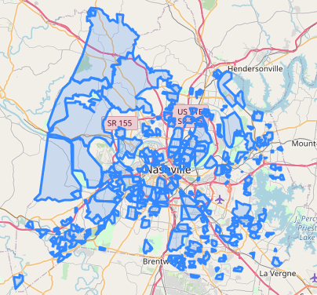

## **What's Happening in my Neighborhood?**
*Work In Progress. Scheduled completion date 6/25/2020. Capstone Project for Data Analytics course at Nashville Software School.* 

### **Contents**  
- [Motivation](#Motivation)
- [Data Questions](#Data-Questions)
- [Known Issues and Challenges](#Known-Issues-and-Challenges)
- [Data Sources and Tools](#Data-Sources-and-Tools)
- [Schedule](#Schedule)
- [Approach Outline](#Approach-Outline)
- [Acknowledgements](#Acknowledgements)

**Nashville is growing and changing rapidly, yet unevenly.** It's difficult for interested residents to know about changes that are being proposed for their neighborhoods. Great information is published daily by Metro Nashville, but the information is spread across several different datasets making it cumbersome to know what is being proposed. Also, growth trends aren’t readily apparent when viewing each dataset individually.  

### **Motivation**   
I live next to a 2.3 acre lot which has sold three times within five years – for $60k in 2014, $130k in 2017, and a whopping $219k in 2019. Why would someone pay that much?! The answer to that question came in the form of a zoning change application shortly after the most recent purchase. The lot is currently zoned for a maximum of eight single family homes (it formerly had one home). The new owner tried to get the zoning changed to allow a 24-unit multi-family complex. No way!   

To make things even more interesting, I also live near the two mile segment of Clarksville Pike that is being widened from two to four lanes. The project is scheduled to be completed by spring 2023. An interactive dashboard drawing from multiple datasets would be an great way to keep an eye on proposed zoning changes and building permit applications. 

I’m drawn to this project because it honors my family legacy. My father had a long career in a small town's building, planning and zoning department and *his* father was the third generation owner of the family lumber company. Building and zoning is in my blood!  
*Back to [Contents](#Contents)*

### **Data Questions**  
- Which neighborhoods have had the most, and the least, growth during the past three years based on count of building permits by type, and by cost of construction.   
- Do any neighborhoods have recent increases in building permit applications which may signal growth in the near future?   
- In instances where zoning changes are sought, might those be a leading indicator of a subsequent increase in building permit applications? If so, what is the average time lag?      

**How can growth trends be researched at the neighborhood level?**   
Growth trends are visible through building permits:  
*“Since all related factors associated with the construction of a building are important economic activities (for example, financing and employment), the building permit report can give a major hint as to the state of the economy in the near future.”*  
https://www.investopedia.com/terms/b/building-permits.asp 

Neighborhood Assocations are a great way to look at trends at a neighborhood level.  

 
**How can residents find information about current and proposed growth?**  
I'll  provide an interactive dashboard prototype, designed to pull information from several datasets simultaneously.   
*Back to [Contents](#Contents)*   

### **Known Issues and Challenges**   
*Potential duplication of building permit counts:* The building permit data includes many Permit Types which are sometimes used at different stages of building at a particular address. For example, a residence at 1000 Gilmore Ave had a permit issued on 5/9/2018 for Residential-Rehab, and a second permit issued a short time later on 5/20/2018 for Residential-Addition. To prevent double-counting, the address and date of issuance will need to be taken into consideration when counting the number of Residential or Commercial building-related permits.   

*Limited data for planning/zoning:* The data for planning/zoning change applications is only retained for a rolling two months after an application has been completed (i.e., denied or approved). This will limit the ability to explore correlations with subsequent or concurrent building permits.   

*Known irregularities due to recent unique events:* The data may have anomalies caused by the March 3rd tornado, the COVID-19 shutdown that started on March 13th, and the “I Can’t Breathe” protests that started May 29th. These events may cause artificial highs or lows in the data that might skew trendlines.    
*Back to [Contents](#Contents)*

### **Data Sources and Tools**   
**Data Sources**   
This project uses data published by data.nashville.gov from two Metro Nashville departments. The data is updated nightly at 2:00 a.m. The Neighborhood Association Boundaries map will be used as well.    
- Building Dept. Permit Applications (rolling three years) 
- Building Dept. Permits Issued (rolling three years) 
- Planning/Zoning Dept. Development Applications (all active applications, and prior two months of completed applications) 
- Neighborhood Assoc. Boundaries (GIS)   
- Davidson County  Border (GIS)
*Back to [Contents](#Contents)*

**Tools**
- `Python`, version 3.7.3 *(default, Apr 24 2019, 15:29:51) [MSC v.1915 64 bit (AMD64)]*   
- `Jupyter Notebook`, version 6.0.0   
- `Tableau`, version TBD   
- `MS Excel`, Microsoft 365    
*Back to [Contents](#Contents)*

### **Schedule**
5/22/2020 ..... Get the data   
6/08/2020 ..... Clean and explore the data, define the MVPs for the charts and the dashboard   
6/15/2020 ..... Research correlations, create charts and dashboard draft  
6/18/2020 ..... Complete presentation    
6/19/2020 ..... Internal demo  
6/25/2020 ..... Demo Day!    
*Back to [Contents](#Contents)*

### **Approach Outline:**    
To track progress on each step I'm using the Project (kanban) board in the GitHub repository. 
- **ETL** to extract the data from data.nashville.gov; examine it to determine what transformation may be needed (if any), and then load it into Python
- Determine what the **MVP** (minimum viable product) looks like for charts and for the intaractive dashboard
- **EDA** (exploratory data analysis). Outline of primary steps (not a comprehensive list of *all* steps)  
    - Examine data types (esp. dates and geography/location/lat&lng)  
    - Look for nulls  
    - Understand what unique values are in each column and seeing which ones are most prevelant and most relevant to answering the data questions
    - Examine statistics for each series with numerical values  
- Determine the best methods for either merging and/or subsetting the data to facilitate creating the charts and creating the dashboard, and explore the answers to the data questions
- Validate that the charts are showing information correctly, with no *irrelevant* data included, and no *relevant* data inadvertently excluded
- Create charts and graphs
- Create dashboard
- Prepare presentation and record demo  
*Back to [Contents](#Contents)*

### **Acknowledgements**
It is challenging to find powerful enough words to describe my gratitude for the instructors and staff at  **Nashville Software School.** 
- Unending thanks to our superb instructors - the inimitable **Mary van Valkenburg,** Program Mgr/Instructor and **Mahesh Rao,** Instructor. 
    - They embraced the challenge of designing NSS's first-ever full time data analytics course - squeezing an impossible amount of training into 15 short weeks. 
    - Then on the third day of class they had to pivot to 100% remote learning due to the novel coronavirus pandemic... and they did so brilliantly! 
- I am indebted to **John Wark,** Founder and CEO, and **all staff** of NSS for their commitment to providing opportunities to those who are underrepresented in technology fields. They have created an incredible organization. 
- **Kristin McKinney,** Partner Development Mgr., has provided an amazing amount of support for our upcoming job search: Three rounds of resume reviews, several mock interviews, panel discussions with local data analysts and hiring managers, demo day, and so much more. You rock!
- **My classmates** were awesome! Each person provided great examples of perseverence, patient collaboration, and the value of having Friday Zoom background themes. 

My career transition was inspired by my husband, **Landry Butler.** It's great to be on this journey together! We are both graduating from NSS's data analytics courses on June 25, 2020 - him from the part time/evening course, and me from the full time/day course. I'm continually inpired by Landry's patience, creativity and easy laughter. Fun times ahead!  
*Back to [Contents](#Contents)*